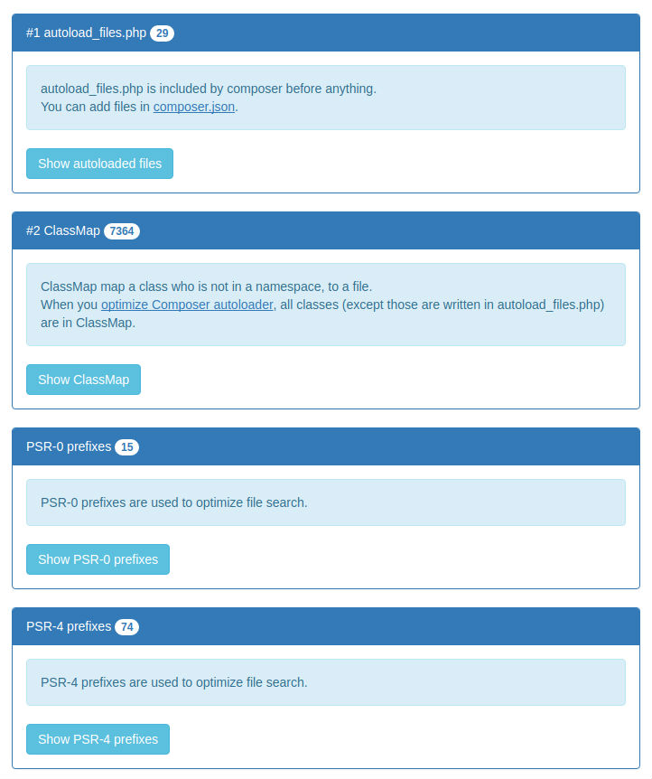

[](https://github.com/huttopia/composer-autoload-stats)
[](https://getcomposer.org)


# Composer autoload stats

All you need to know about autoload with Composer, in a single file, without any dependency.

# Installation

Just copy [composer_stats.php](composer_stats.php) in your public directory, and open it (exemple : http://localhost/composer_stats.php).

Of course, you can add it to your project, if you want :

```bash
composer require huttopia/composer-autoload-stats ^1.0
```

# Screenshots



